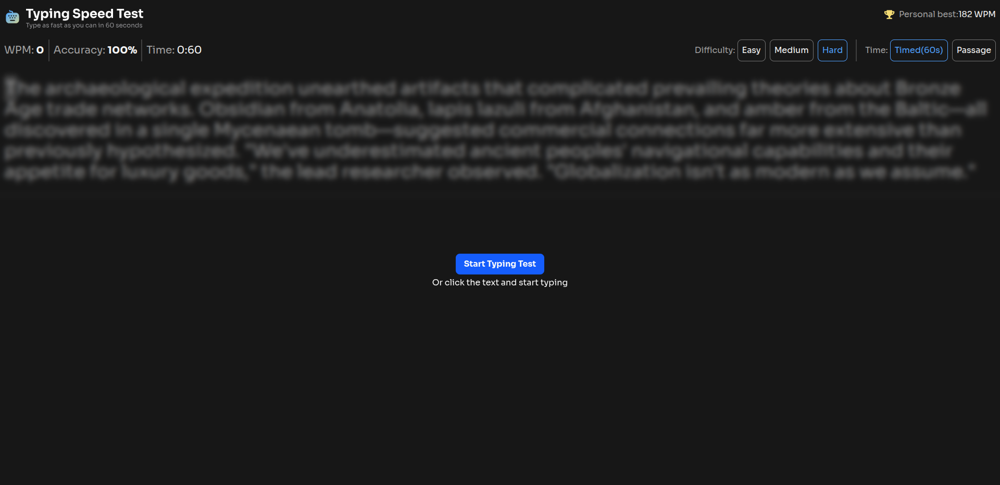
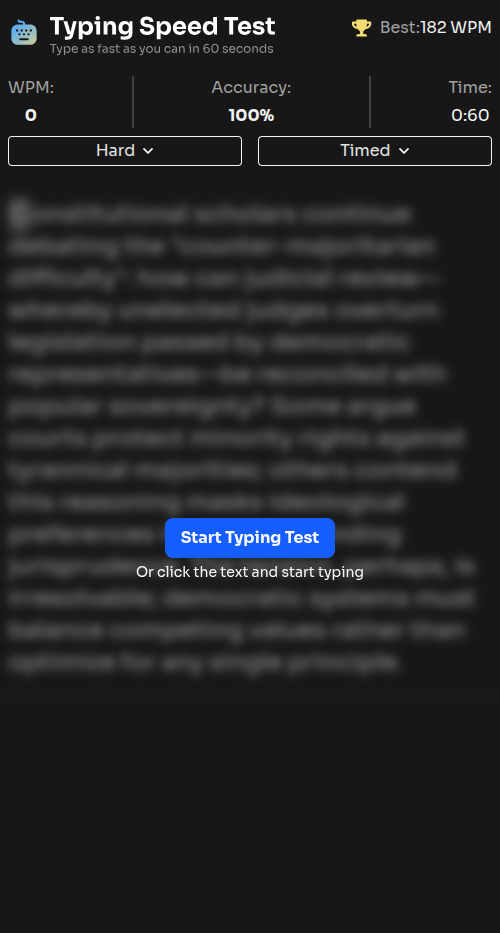
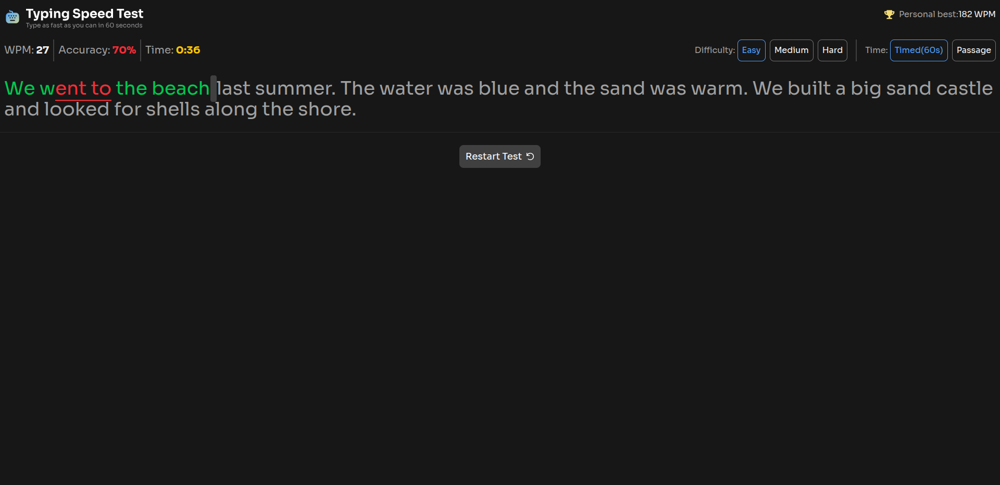

# Typing speed test

This project is a classic "rite of passage" for developers. It’s a project that looks simple on the surface but offers a deep dive into DOM manipulation, real-time data processing, and state management.

[**View Live Demo**](https://fem-typing-speed-test.vercel.app) | [**Browse Source Code**](https://github.com/ZTanvir/fem-typing-speed-test)

<video src="" controls width="100%"></video>




## Core functionalities

- Start the test via button or click, select a difficulty level (Easy/Medium/Hard), toggle between 60s Timed or unlimited Passage modes, and restart anytime for a fresh random passage.
- Monitor real-time WPM, accuracy, and time stats while receiving immediate visual feedback for correct characters (green), errors (red/underlined), and cursor positioning, with backspace functionality that allows for corrections while still tracking original mistakes against the total accuracy.
- After completing a test, view detailed results including WPM, accuracy, and character breakdowns, with the system providing "Baseline Established!" or "High Score Smashed!" milestones (complete with confetti) that persist as a personal best across sessions via localStorage.

## Technologies used

- React
- Typescript
- Fetch
- React router
- Tailwind
- Vitest
- Github action
- Vite

## Purpose & Goal

The purpose of this project is to provide a high-performance, interactive web application that helps users measure and improve their typing proficiency.

## Killer features

### **Dynamic Test Modes:**

Toggle between a 60s Timed sprint or an Unlimited Passage mode.

### **Difficulty Scaling:**

Select from Easy, Medium, or Hard levels to fetch varying complexity of text.

### **Real-time Analytics:**

Monitor WPM (Words Per Minute), Accuracy %, and Timer updates on every keystroke.

- Green:Correct character.
- Red/Underlined: Error detection.
- Active Cursor: Real-time positioning with full backspace support.



### **Persistence & Gamification:**

High scores are saved via `localStorage`. Smashed a personal best? The system celebrates with a confetti milestone!

## Lesson learned

### ** Solving UI Glitches With useLayoutEffect **

useEffect run after dom paint . So if we use useEffect to update the ui, there will be no ui glitch that hamper the ux.

### **Think of trade-off**

Originally, I attached a `keydown` event listener to a user input div. On desktop, this worked perfectly, it was clean. However, when testing on mobile devices, I hit a major roadblock the virtual keyboard wouldn't trigger.

After some digging I have find out I have to use input field to take use input . So I have clean the event listener from div and add to `textArea`
to get user input.

## Getting Started

To get a local copy of this project up and running, follow these steps.

### Prerequisites

- **Node.js** (v18.x or higher)
- **Npm**: If you prefer using npm for package management and running scripts.

## Installation

1. **Clone the repository:**

   ```bash
   git clone https://github.com/ZTanvir/fem-typing-speed-test
   cd fem-typing-speed-test
   ```

2. **Install dependencies:**

   Using Npm:

   ```bash
   npm install
   ```

3. **Start the json server:**

   ```bash
   npm run json-server
   ```

   Open [http://localhost:3000](http://localhost:3000) to view the app data in your browser.

4. **Start the development server:**

   ```bash
   npm run dev
   ```

   Open [http://localhost:5173/](http://localhost:5173/) to view the app in your browser.
